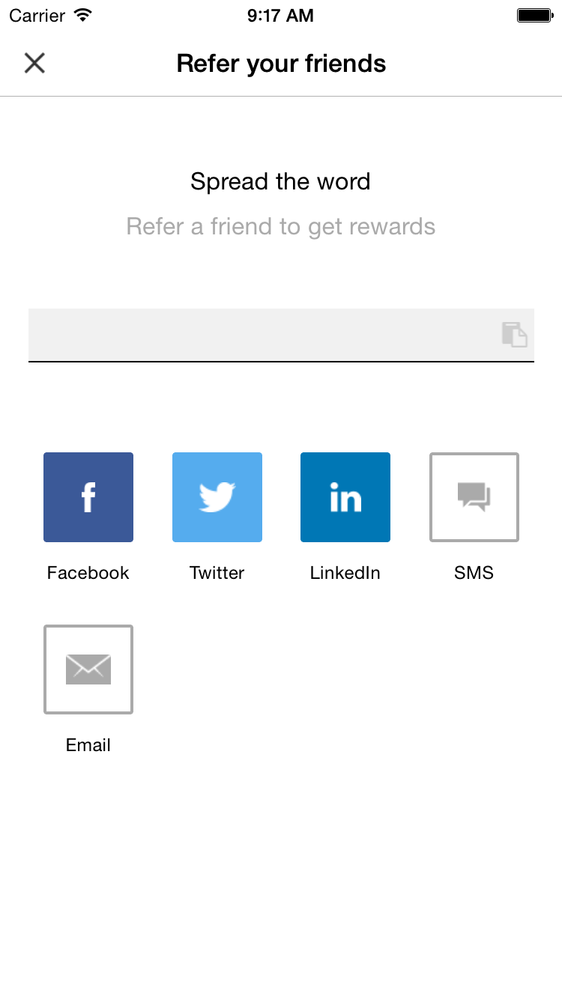
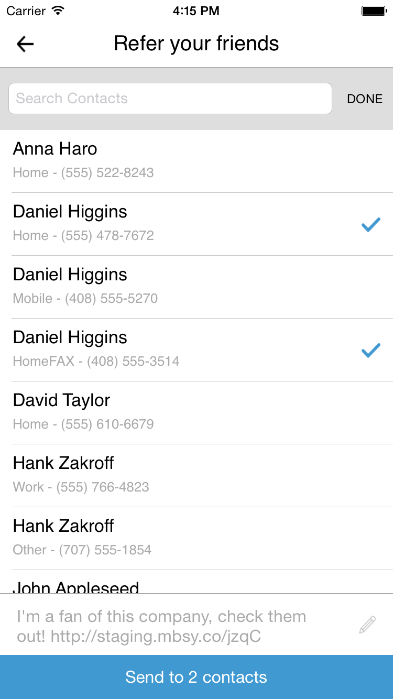

# Ambassador iOS SDK

## Getting Started
Install Git hooks:
```
ln -s ../../git-hooks/prepare-commit-msg .git/hooks/prepare-commit-msg
```

## Documentation
### Initializing Ambassador
* Download the framework file and copy it to your project directory.
* Add the framework under the 'Embedded Binaries' section under project settings.
* You initialize Ambassador in the ```application:application didFinishLaunchingWithOptions:``` method of your app delegate. You can initialize with the option to register a conversion upon app launch by passing in a conversion object (see *[Conversions](### Conversions)*):
```objective-c
[Ambassador runWithKey:/*<your_ambassador_API_key_string>*/ convertingOnLaunch:<your_conversion_parameters_object>];
```
**OR** pass in nil to opt out of a conversion on launch:
```objective-c
[Ambassador runWithKey:/*<your_ambassador_API_key_string>*/ convertingOnLaunch:nil];
```

### Identifying a User
In order to track a conversion and provide users with custom share links, Ambassador only needs the email address of the user. The call to identify the user should be done as early in the app to make sure all Ambassador services can be provided as soon as possible:
```objective-c
[Ambassador identifyWithEmail:@"user@example.com"];
```

### Conversions
Conversions can be triggered from anywhere. Common places could be a view controller's ```viewDidLoad``` or on a button event. You register a conversion in the following way:
```objective-c
// STEP ONE: Create the parameter object
ConversionParameters *conversion = [[ConversionParameters alloc] init];

// STEP TWO: Set the required properties
conversion.mbsy_revenue = @10; // NSNumber
conversion.mbsy_campaign = @101; // NSNumber
conversion.mbsy_email = @"user@example.com"; // NSString

// STEP THREE: Set any optional properties
conversion.mbsy_add_to_group_id = @123; // NSNumber
conversion.mbsy_first_name = @"John"; // NSString
conversion.mbsy_last_name = @"Doe"; // NSString
conversion.mbsy_email_new_ambassador = @YES; // BOOL
conversion.mbsy_uid = @"mbsy_uid"; // NSString
conversion.mbsy_custom1 = @"custom1"; // NSString
conversion.mbsy_custom2 = @"custom2"; // NSString
conversion.mbsy_custom3 = @"custom3"; // NSString
conversion.mbsy_auto_create = @NO; // BOOL
conversion.mbsy_deactivate_new_ambassador = @YES; // BOOL
conversion.mbsy_transaction_uid = @"trans_uid"; // NSString
conversion.mbsy_event_data1 = @"eventdata1"; // NSString
conversion.mbsy_event_data2 = @"eventdata2"; // NSString
conversion.mbsy_event_data3 = @"eventdata3"; // NSString
conversion.mbsy_is_approved = @NO; // BOOL

// STEP FOUR: Register the conversion with the parameter object
[Ambassador registerConversion:conversion];
```
### Presenting the 'Refer A Friend' Screen (RAF)
The RAF screen allows users to share with their contcts and become part of your referall program.
To present a RAF, you only need to pass in the campaign ID you would like the sharing to be associated with as well as the view controller from which it will be presented.

**It is important that the view controller being passed is in the view hierarchy before the call is made. (If the RAF is going to be presented upon the launch of the view controller, but the method call in ```viewDidApprear:``` instead of ```viewDidLoad```)**

**Identify should also be called before any calls to present a RAF. Identify will need to generate/update the short urls, and therefore should not be placed immediately before any RAF presentation calls.  This will allow the share urls to be generated for your user. If identify is not called before, or a campaign ID that does not exist is passed, a warning will be logged to let you know**

####RAF Parameters
The RAF screen labels and navigation title can be customized with RAF Parameters.  These parameters are optional, and if not set or set to nil, default strings will be used.

* Navigation Title - "Refer your friends"
* Welcome Title - "Spread the word"
* Welcome Description - "Refer a friend to get rewards"
* Default Share Message - "I'm a fan of this company, check them out!"

   

```objective-c  
// Create the RAFParameters object
RAFParameters *rafParams = [[RAFParameters alloc] init];

// Set the properties of the RAFParameters object
rafParams.navBarTitle = @"New navBar title"; // NSString
rafParams.welcomeTitle = @"New welcome title"; // NSString
rafParams.welcomeDescription = @"This is test description"; // NSString
rafParams.defaultShareMessage = @"Share this test please!"; // NSString

// Present the RAF Modal View
[Ambassador presentRAFForCampaign:@"877" FromViewController:self WithRAFParameters:rafParams];
```
