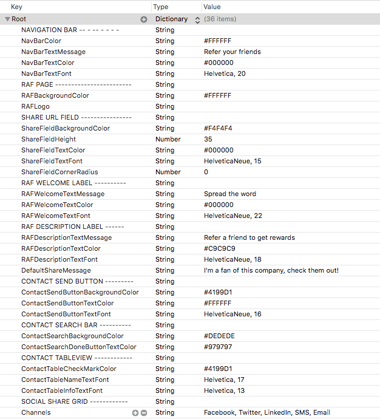
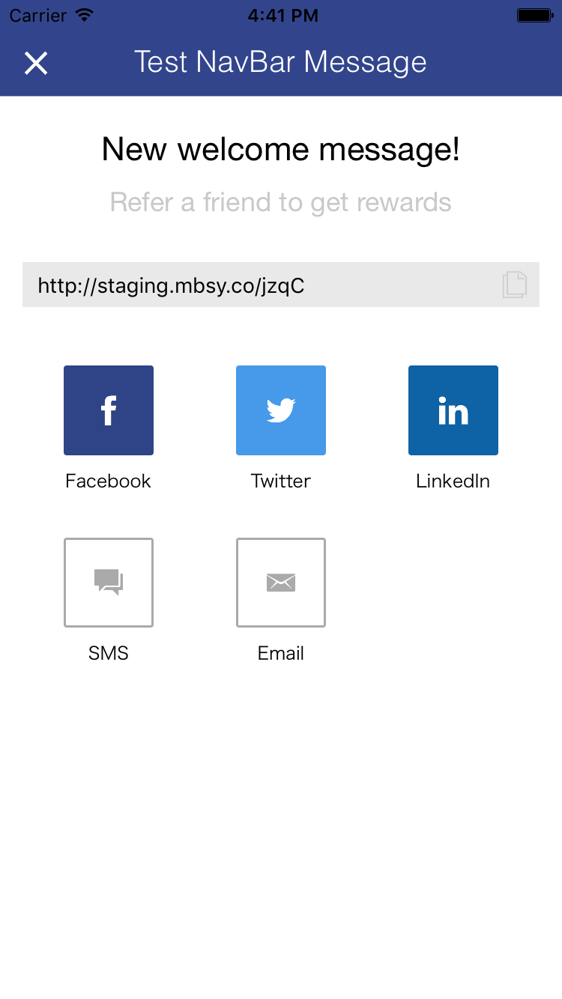
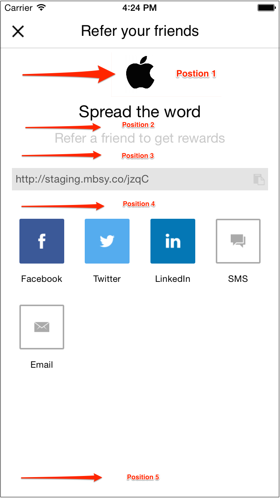
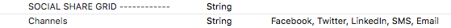
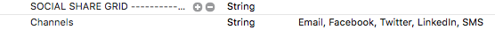

# Ambassador iOS SDK

## Getting Started
Install Git hooks:
```
$ ln -s ../../git-hooks/prepare-commit-msg .git/hooks/prepare-commit-msg
$ ln -s ../../git-hooks/pre-push .git/hooks/pre-push
```

The `pre-push` hook requires re-initialization of the repo:
```
$ git init
```

Make sure the `pre-push` hook is executable:
```
$ chmod +x .git/hooks/pre-push
```

## Documentation
## Installing the SDK
Follow the steps to install the Ambassador SDK in your Objective-c or Swift project.
* Download the framework zip file, unzip it, and drag Ambassador.framework and Ambassador.bundle into your project, as shown below, beneath the project file (the zip file is attached at the bottom of this article).

  

* Elect to copy the framework files into your project

  

* Go to __Build Phases__ and link to the following library:
  * libicucore


* Add an `-ObjC` flag under `Build Settings > Other Linker Flags`


### Adding a bridging header (Swift projects)
The SDK is written in Objective-c. In addition to the previous steps, installing the SDK into a Swift project requires a bridging header. If your project doesn't already have a bridging header, you can add one easily. If you already have a bridging header due to another library or framework, you can go to [Configuring a Bridging header (Swift Projects)](#config-bridge)

* Add a new file to your project.

  

* Select the Objective-C file type.

  

* This is essentially a dummy file, and you can name it anything.

  

* A Prompt will appear asking if you want to configure a bridging header. Select yes.

  

* This will create both the dummy Objective-C file and a bridging header sharing the name of your project.

  

* At this point, you can delete the dummy Objective-C file. It is no longer needed.

  

### <a name="config-bridge"></a>Configuring a Bridging header (Swift projects)

In the bridging header, add an import statement for the Ambassador SDK.

```objective-c
#import <Ambassador/Ambassador.h>
```

## Initializing Ambassador

### Step 1
If you're using Objective-C, import the Ambassador framework in your `AppDelegate.m`.

  **Objective-c**
  ```objective-c
  #import <Ambassador/Ambassador.h>
  ```

### Step 2
You will want to run Ambassador inside of the  `application:didFinishLaunchingWithOptions:` function in your `AppDelegate.m`.

**Objective-c**
```objective-c
- (BOOL)application:(UIApplication *)application didFinishLaunchingWithOptions:(NSDictionary *)launchOptions {
  // Override point for customization after application launch.

  [AmbassadorSDK runWithUniversalToken:<your_universal_token> universalID:<your_universal_id>];

  return YES;
}
```

**Swift**
```objective-c
func application(application: UIApplication, didFinishLaunchingWithOptions launchOptions: [NSObject: AnyObject]?) -> Bool {
    // Override point for customization after application launch.

    AmbassadorSDK.runWithUniversalToken(<your_universal_token>, universalID:<your_universal_id>)

    return true
}
```

## Identifying a User
In order to track referrals and provide users with custom share links,
Ambassador only needs the email address of the user. The call to identify
the user should be done early in the app to make sure all Ambassador services
 can be provided as soon as possible. We recommend putting it on a login screen
 or after the initial call to run Ambassador if you have the user's email stored.

 **Objective-c**
```objective-c
[AmbassadorSDK identifyWithEmail:@"user@example.com"];
```

**Swift**

```objective-c
AmbassadorSDK.identifyWithEmail("user@example.com")
```

## Conversions
Conversions can be triggered from anywhere. Common places could be a view controller's ```viewDidLoad``` or on a button event.

** Note:** The **restrictToInsall** boolean should only be set to YES
 when converting on install.  An ideal place to register an install conversion
 would be right after obtaining the user's email address

**Objective-c**
```objective-c
// STEP ONE: Create a conversion parameters object
AMBConversionParameters *parameters = [[AMBConversionParameters alloc] init];

// STEP TWO: Set the required properties
parameters.mbsy_revenue = @10; // NSNumber
parameters.mbsy_campaign = @101; // NSNumber
parameters.mbsy_email = @"user@example.com"; // NSString

// STEP THREE: Set any optional properties
parameters.mbsy_add_to_group_id = @"123"; // NSString
parameters.mbsy_first_name = @"John"; // NSString
parameters.mbsy_last_name = @"Doe"; // NSString
parameters.mbsy_email_new_ambassador = @NO; // BOOL (Defaults to @NO)
parameters.mbsy_uid = @"mbsy_uid"; // NSString
parameters.mbsy_custom1 = @"custom1"; // NSString
parameters.mbsy_custom2 = @"custom2"; // NSString
parameters.mbsy_custom3 = @"custom3"; // NSString
parameters.mbsy_auto_create = @YES; // BOOL (Defaults to @YES)
parameters.mbsy_deactivate_new_ambassador = @NO; // BOOL (Defaults to @NO)
parameters.mbsy_transaction_uid = @"trans_uid"; // NSString
parameters.mbsy_event_data1 = @"eventdata1"; // NSString
parameters.mbsy_event_data2 = @"eventdata2"; // NSString
parameters.mbsy_event_data3 = @"eventdata3"; // NSString
parameters.mbsy_is_approved = @YES; // BOOL (Defaults to @YES)

// STEP FOUR: Register the conversion with the parameter object.
[AmbassadorSDK registerConversion:parameters restrictToInsall:NO completion:^(NSError *error) {
    if (error) {
        NSLog(@"There was an error - %@", error);
    } else {
        NSLog(@"All conversion parameters are set properly");
    }
}];
```

**Swift**
```objective-c
// STEP ONE: Create a conversion parameters object
let parameters = AMBConversionParameters()

// STEP TWO: Set the required properties
parameters.mbsy_revenue = 10 // NSNumber
parameters.mbsy_campaign = 101 // NSNumber
parameters.mbsy_email = "user@example.com" // NSString

// STEP THREE: Set any optional properties
parameters.mbsy_add_to_group_id = "123" // NSString
parameters.mbsy_first_name = "John" // NSString
parameters.mbsy_last_name = "Doe" // NSString
parameters.mbsy_email_new_ambassador = false // BOOL (Defaults to false)
parameters.mbsy_uid = "mbsy_uid" // NSString
parameters.mbsy_custom1 = "custom1" // NSString
parameters.mbsy_custom2 = "custom2" // NSString
parameters.mbsy_custom3 = "custom3" // NSString
parameters.mbsy_auto_create = true // BOOL (Defaults to true)
parameters.mbsy_deactivate_new_ambassador = false // BOOL (Defaults to false)
parameters.mbsy_transaction_uid = "trans_uid" // NSString
parameters.mbsy_event_data1 = "eventdata1" // NSString
parameters.mbsy_event_data2 = "eventdata2" // NSString
parameters.mbsy_event_data3 = "eventdata3" // NSString
parameters.mbsy_is_approved = true // BOOL (Defaults to true)

// STEP FOUR: Register the conversion with the parameter object
AmbassadorSDK.registerConversion(parameters, restrictToInsall: false) { (error) -> Void in
  if ((error) != nil) {
      println("Error \(error)")
  } else {
      println("All conversion parameters are set properly")
  }
}
```

## Presenting the 'Refer A Friend' Screen (RAF)

### Presenting the RAF
**Objective-c**
```objective-c
// Present the RAF Modal View
[AmbassadorSDK presentRAFForCampaign:<campaign ID> FromViewController:self withThemePlist:@"GenericTheme"];
```

**Swift**
```objective-c
// Present the RAF Modal View
AmbassadorSDK.presentRAFForCampaign(<campaign ID>, fromViewController: self, withThemePlist: "GenericTheme")
```

**NOTES**

* **It is important that the view controller being passed is in the view hierarchy before the call is made. (If the RAF is going to be presented upon the launch of the view controller, but the method call in ```viewDidApprear:``` instead of ```viewDidLoad```)**

* **Identify should also be called before any calls to present a RAF. Identify will need to generate/update the short urls, and therefore should not be placed immediately before any RAF presentation calls.  This will allow the share urls to be generated for your user. If identify is not called before, or a campaign ID that does not exist is passed, a warning will be logged to let you know**

### Customizing the RAF Screen
The RAF screen provides a UI component that allows users to share with their contacts and become part of your referral program.
To allow customization, there is a `GenericTheme.plist` where you can set many editable properties of the RAF, including colors, messages, fonts, and images.

  

If you leave any property unset, the RAF will use the default values shown below.
Any blank or incorrect values inserted into the `GenericTheme.plist` will default to:
* Colors - White
* Fonts - **System Font** of size **14**
* Messages - **"NO PLIST VALUE FOUND"**
* Images - No image will be added

**If you are UPDATING the SDK, make sure to copy any customized plists to a safe place so that you can re-add them later**

The `GenericTheme.plist` will come with preconfigured values looking like this:

  

This is what the default theme will look like with the preconfigured values in the `GenericTheme.plist`.

     

To demonstrate how to change the default theme, here is the GenericTheme.plist with some edited values:

  

The results from the minor changes will look like this:

     

### Adding an image to the RAF Page

You can add an image to the RAF Widget by editing the **RAFLogo** plist value:
* **NOTE**: The image you reference from the GenericTheme.plist must be in your app's **Images.xcassets** folder

    

The way to enter an image will look like `<image name>, <position>`.  Ex: `appleLogo, 1`.  The 'postion' number after the name(in this case the '1') represents the position of the image on the screen.

* **NOTE**: The position number must be 1-5

  

### Reordering Sharing Channels

Any Sharing Channels can be reordered. The Sharing Channels are ordered in a list separated by commas that can be found in the  __GenericTheme.plist__.

This is the standard ordering with Facebook appearing first and Email last.

  

  

Modifying the order of the list, as seen below, will move Email to the first position in the collectionView.

  

  

### Disabling Sharing Channels

Any Sharing Channel can be disabled if it is irrelevant to your campaign. Removing a Sharing Channel from the list will completely remove it from the collectionView.

Removing __LinkedIn__ from the list would result in the LinkedIn Sharing Channel not displaying in your app.


  

  

### Theming multiple RAFs using different Theming plists

Your app may include various RAF Screens that triggered by different events. You can use different themes for each RAF by following the steps below:

Right click __GenericTheme.plist__ and select __Show in Finder__

  

You should now see the __GenericTheme.plist__ in a Finder window

  

Right click __GenericTheme.plist__ and select __Duplicate__

  

Rename the duplicate to the name of your new plist. The new plist should now show up in your project navigator

  

You can now alter your new plist's values to create a new look for a different RAF. You would apply it to a new RAF by using the following code:

```objective-c
// Present the RAF Modal View
[AmbassadorSDK presentRAFForCampaign:<campaign ID> FromViewController:self withThemePlist:@"newPlist"];
```
You can use as many plists as you want and apply them to different RAFs throughout your app

**NOTES FOR CUSTOM THEMES**
* **Colors must be entered as Hex Code values**
* **Make sure when adding custom colors to the plist that you include a `#` in front of the Hex Code or it may result with incorrect colors**
* **Fonts are typically entered as `<FontName>, <FontSize>`.  Ex: `Helvetica, 12`**
* **If you leave out the font size or if the font returns a nil value, it will be defaulted to size 14**
