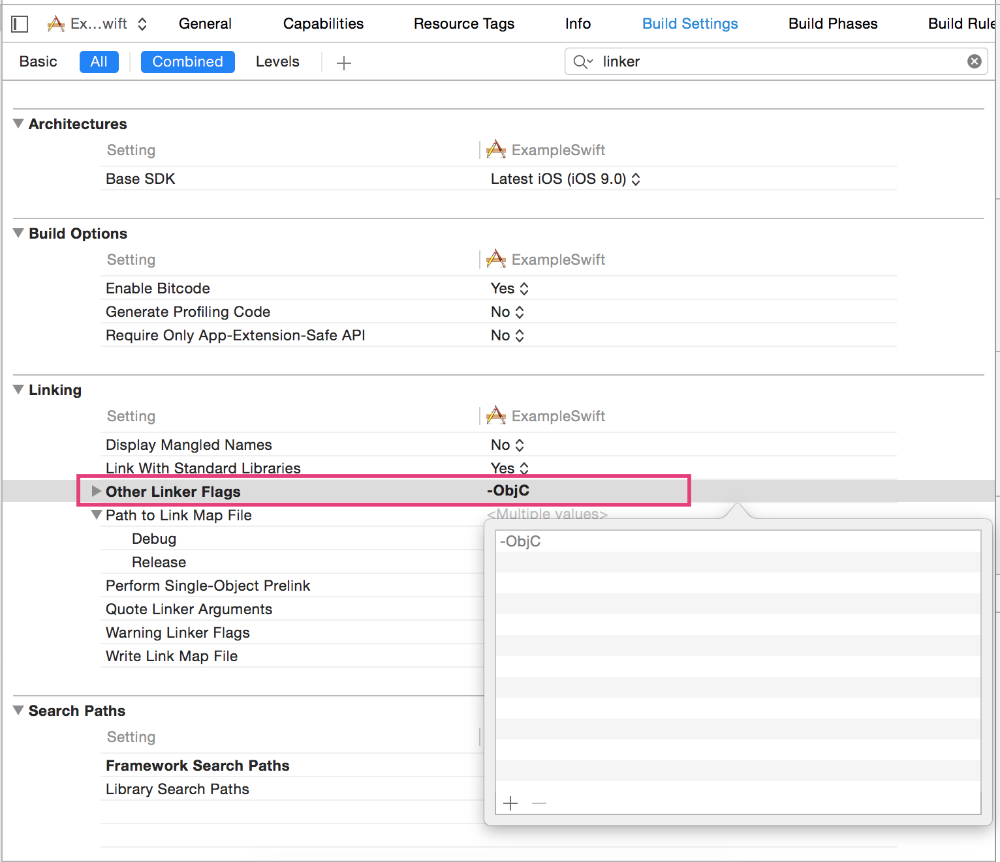

# Ambassador iOS SDK

## Getting Started
Install Git hooks:
```
ln -s ../../git-hooks/prepare-commit-msg .git/hooks/prepare-commit-msg
```

## Documentation
## Installing the SDK
Follow the steps to install the Ambassador SDK in your Objective-c or Swift project.
* Download the framework file, unzip it, and drag it into your project, as shown below, beneath the project file (the zip file is attached at the bottom of this article).

  

* Elect to copy the framework files into your project

  

* Click **'+'** under the **Embedded Binaries** section under project settings to add a new binary.

  

* Select **Ambassador.framework** and click **Add**

  

* You may need to remove a duplicate instance of the framework file under **Linked Frameworks and Libraries**.  

  

### Slicing the framework
For convenience, we distribute a fat binary that will work with both xCode simulators and physical devices. This is great for development, but is not acceptable for app submission to the iTunes store.
You can still build using the fat binary by 'slicing' out the architectures specific to your build. This can be done with a simple run script.

* In your project's **Build Phases**, add a new **Run Script Phase** (Make sure that the run script is placed *BELOW* **Embedded Frameworks**).

  

* Expand the newly added run script item.

  

* Copy and paste the following script.

```shell
code_sign() {
    # Use the current code_sign_identitiy
    echo "Code Signing $1 with Identity ${EXPANDED_CODE_SIGN_IDENTITY_NAME}"
    echo "/usr/bin/codesign --force --sign ${EXPANDED_CODE_SIGN_IDENTITY} --preserve-metadata=identifier,entitlements $1"
    /usr/bin/codesign --force --sign ${EXPANDED_CODE_SIGN_IDENTITY} --preserve-metadata=identifier,entitlements "$1"
}

APP_PATH="${TARGET_BUILD_DIR}/${WRAPPER_NAME}"

# Find the Ambassador binary in the project directory
PATH_TO_AMB_FILE=$(find "$PROJECT_DIR" -name "Ambassador.framework" -print -quit)
PATH_TO_AMB_FILE="$PATH_TO_AMB_FILE"
echo "Framework search directory is at $PATH_TO_AMB_FILE"
PATH_TO_AMB_FILE="$PATH_TO_AMB_FILE/Ambassador"
echo "The framework is at $PATH_TO_AMB_FILE"

# Log code signiture of the Ambassador binary in project directory
codesign -vv -d "$PATH_TO_AMB_FILE"

# Find the Ambassador binary in the build directory
FRAMEWORK_EXECUTABLE_PATH=$(find "$APP_PATH" -name "Ambassador.framework" -print -quit)
FRAMEWORK_EXECUTABLE_PATH="$FRAMEWORK_EXECUTABLE_PATH"
echo "Executable folder is $FRAMEWORK_EXECUTABLE_PATH"
FRAMEWORK_EXECUTABLE_PATH="$FRAMEWORK_EXECUTABLE_PATH/Ambassador"
echo "Executable folder is $FRAMEWORK_EXECUTABLE_PATH"

# Log code signiture of the Ambassador binary in build directory
codesign -vv -d "$FRAMEWORK_EXECUTABLE_PATH"

# Copy a fresh binary from the project directory into build directory
cp "$PATH_TO_AMB_FILE" "$FRAMEWORK_EXECUTABLE_PATH"

# Extract relevant architectures for this build
EXTRACTED_ARCHS=()
for ARCH in $ARCHS
do
echo "Extracting $ARCH from $FRAMEWORK_EXECUTABLE_NAME"
lipo -extract "$ARCH" "$FRAMEWORK_EXECUTABLE_PATH" -o "$FRAMEWORK_EXECUTABLE_PATH-$ARCH"
EXTRACTED_ARCHS+=("$FRAMEWORK_EXECUTABLE_PATH-$ARCH")
done

# Merge the extracted archetectures into single binary
echo "Merging extracted architectures: ${ARCHS}"
lipo -o "$FRAMEWORK_EXECUTABLE_PATH-merged" -create "${EXTRACTED_ARCHS[@]}"
rm "${EXTRACTED_ARCHS[@]}"

# Replace old universal binary with new thin version
echo "Replacing original executable with thinned version"
rm "$FRAMEWORK_EXECUTABLE_PATH"
mv "$FRAMEWORK_EXECUTABLE_PATH-merged" "$FRAMEWORK_EXECUTABLE_PATH"

# Sign the new binary with project's signing identity
if [ $EXPANDED_CODE_SIGN_IDENTITY ]; then
echo "A signing identity exists"
code_sign "$FRAMEWORK_EXECUTABLE_PATH"
codesign -vv -d "$FRAMEWORK_EXECUTABLE_PATH"
else
echo "A signing identity does not exist"
fi

```

### Adding a bridging header (Swift projects)
The SDK is written in Objective-c. In addition to the previous steps, installing the SDK into a Swift project requires a bridging header. If your project doesn't already have a bridging header, you can add one easily. If you already have a bridging header due to another library or framework, you can go to [Configuring a Bridging header (Swift Projects)](#config-bridge)

* Add a new file to your project.

  

* Select the Objective-C file type.

  

* This is essentially a dummy file, and you can name it anything.

  

* A Prompt will appear asking if you want to configure a bridging header. Select yes.

  

* This will create both the dummy Objective-C file and a bridging header sharing the name of your project.

  

* At this point, you can delete the dummy Objective-C file. It is no longer needed.

  

### <a name="config-bridge"></a>Configuring a Bridging header (Swift projects)

In the bridging header, add an import statement for the Ambassador SDK.

```objective-c
#import <Ambassador/Ambassador.h>
```

## Initializing Ambassador

### Step 1
  In your `AppDelegate.m` import the Ambassador framework.

  **Objective-c**
  ```objective-c
  #import <Ambassador/Ambassador.h>
  ```

  **Swift**
  ```javascript
  import Ambassador
  ```

### Step 2
You run Ambassador inside `application:didFinishLaunchingWithOptions:`
and have the option to convert on install. This will register a conversion
the first time the app is launched. More on conversions and setting their
parameters in [Conversions](#conversions). Your API key will be provided to you by Ambassador.

**Objective-c**
```objective-c
- (BOOL)application:(UIApplication *)application didFinishLaunchingWithOptions:(NSDictionary *)launchOptions {
  // Override point for customization after application launch.

  // If you don't want to register a conversion during the first launch of your
  // application, then pass nil for the convertOnInstall parameter
  [AmbassadorSDK runWithKey:<your_API_key> convertOnInstall:nil];

  //--OR--

  // If you would like to register a conversion for one of your campaigns,
  // create a conversion object to pass for the convertOnInstall parameter
  ConversionParameters *parameters = [[ConversionParameters alloc] init];
  // ... set parameters' properties (more on this in the "Conversions" section)
  [AmbassadorSDK runWithKey:<your_API_key> convertOnInstall:parameters];

  return YES;
}
```

**Swift**
```objective-c
func application(application: UIApplication, didFinishLaunchingWithOptions launchOptions: [NSObject: AnyObject]?) -> Bool
{
    // Override point for customization after application launch.

    // If you don't want to register a conversion during the first launch of your
    // application, then pass nil for the convertOnInstall parameter
    AmbassadorSDK.runWithKey(<your_API_key>)

    //--OR--

    // If you would like to register a conversion for one of your campaigns,
    // create a conversion object to pass for the convertOnInstall parameter
    var parameters = ConversionParameters()
    // ... set parameters' properties (more on this in the "Conversions" section)
    AmbassadorSDK.runWithKey(<your_API_key>, convertOnInstall: parameters)

    return true
}
```

## Identifying a User
In order to track referrals and provide users with custom share links,
Ambassador only needs the email address of the user. The call to identify
the user should be done early in the app to make sure all Ambassador services
 can be provided as soon as possible. We recommend putting it on a login screen
 or after the initial call to run Ambassador if you have the user's email stored.

 **Objective-c**
```objective-c
[AmbassadorSDK identifyWithEmail:@"user@example.com"];
```

**Swift**

```objective-c
AmbassadorSDK.identifyWithEmail("user@example.com")
```

## Conversions
Conversions can be triggered from anywhere. Common places could be a view controller's ```viewDidLoad``` or on a button event.

**Objective-c**
```objective-c
// STEP ONE: Create a conversion parameters object
ConversionParameters *conversion = [[ConversionParameters alloc] init];

// STEP TWO: Set the required properties
conversion.mbsy_revenue = @10; // NSNumber
conversion.mbsy_campaign = @101; // NSNumber
conversion.mbsy_email = @"user@example.com"; // NSString

// STEP THREE: Set any optional properties
conversion.mbsy_add_to_group_id = @"123"; // NSString
conversion.mbsy_first_name = @"John"; // NSString
conversion.mbsy_last_name = @"Doe"; // NSString
conversion.mbsy_email_new_ambassador = @NO; // BOOL (Deafaults to @NO)
conversion.mbsy_uid = @"mbsy_uid"; // NSString
conversion.mbsy_custom1 = @"custom1"; // NSString
conversion.mbsy_custom2 = @"custom2"; // NSString
conversion.mbsy_custom3 = @"custom3"; // NSString
conversion.mbsy_auto_create = @YES; // BOOL (Defaults to @YES)
conversion.mbsy_deactivate_new_ambassador = @NO; // BOOL (Defaults to @NO)
conversion.mbsy_transaction_uid = @"trans_uid"; // NSString
conversion.mbsy_event_data1 = @"eventdata1"; // NSString
conversion.mbsy_event_data2 = @"eventdata2"; // NSString
conversion.mbsy_event_data3 = @"eventdata3"; // NSString
conversion.mbsy_is_approved = @YES; // BOOL (Defaults to @YES)

// STEP FOUR: Register the conversion with the parameter object
[AmbassadorSDK registerConversion:conversion];
```

**Swift**
```objective-c
// STEP ONE: Create a conversion parameters object
var parameters = ConversionParameters()

// STEP TWO: Set the required properties
parameters.mbsy_revenue = 10 // NSNumber
parameters.mbsy_campaign = 101 // NSNumber
parameters.mbsy_email = "user@example.com" // NSString

// STEP THREE: Set any optional properties
parameters.mbsy_add_to_group_id = "123" // NSString
parameters.mbsy_first_name = "John" // NSString
parameters.mbsy_last_name = "Doe" // NSString
parameters.mbsy_email_new_ambassador = false // BOOL (Deafaults to false)
parameters.mbsy_uid = "mbsy_uid" // NSString
parameters.mbsy_custom1 = "custom1" // NSString
parameters.mbsy_custom2 = "custom2" // NSString
parameters.mbsy_custom3 = "custom3" // NSString
parameters.mbsy_auto_create = true // BOOL (Defaults to true)
parameters.mbsy_deactivate_new_ambassador = false // BOOL (Defaults to false)
parameters.mbsy_transaction_uid = "trans_uid" // NSString
parameters.mbsy_event_data1 = "eventdata1" // NSString
parameters.mbsy_event_data2 = "eventdata2" // NSString
parameters.mbsy_event_data3 = "eventdata3" // NSString
parameters.mbsy_is_approved = true // BOOL (Defaults to true)

// STEP FOUR: Register the conversion with the parameter object
AmbassadorSDK.registerConversion(parameters)
```

## Presenting the 'Refer A Friend' Screen (RAF)
### ShareService Preferences
The RAF screen provides a UI component that allows users to share with their contacts and become part of your referral program.
To allow customized messages, there is also a `ShareServicePreferences` object where you can set editable properties of the RAF.
If you leave any property unset, the RAF will use the default strings shown below.

   

The editable properties and their default strings are:
* `navBarTitle` - "Refer your friends"
* `titleLableText` - "Spread the word"
* `descriptionLabelText` - "Refer a friend to get rewards"
* `defaultShareMessage` - "I'm a fan of this company, check them out!"

### Presenting the RAF
**Objective-c**
```objective-c
// STEP ONE: Create a share service preferences object
ServiceSelectorPreferences *preferences = ServiceSelectorPreferences()

// STEP TWO: (optional) Set the properties
preferences.navBarTitle = @"New navBar title"; // NSString
preferences.titleLabelText = @"New welcome title"; // NSString
preferences.descriptionLabelText = @"This is test description"; // NSString
preferences.defaultShareMessage = @"Share this test please!"; // NSString

// STEP THREE: Present the RAF Modal View
[AmbassadorSDK presentRAFForCampaign:@"877" FromViewController:self WithRAFParameters:preferences];
```

**Swift**
```objective-c
// STEP ONE: Create a share service preferences object
var preferences = ServiceSelectorPreferences()

// STEP TWO: (optional) Set the properties
preferences.navBarTitle = "New navBar title" // NSString
preferences.titleLabelText = "New welcome title" // NSString
preferences.descriptionLabelText = "This is test description" // NSString
preferences.defaultShareMessage = "Share this test please!" // NSString

// STEP THREE: Present the RAF Modal View
AmbassadorSDK.presentRAFForCampaign("877", fromViewController: self, withRAFParameters: preferences)
```

**NOTES**

* **It is important that the view controller being passed is in the view hierarchy before the call is made. (If the RAF is going to be presented upon the launch of the view controller, but the method call in ```viewDidApprear:``` instead of ```viewDidLoad```)**

* **Identify should also be called before any calls to present a RAF. Identify will need to generate/update the short urls, and therefore should not be placed immediately before any RAF presentation calls.  This will allow the share urls to be generated for your user. If identify is not called before, or a campaign ID that does not exist is passed, a warning will be logged to let you know**
